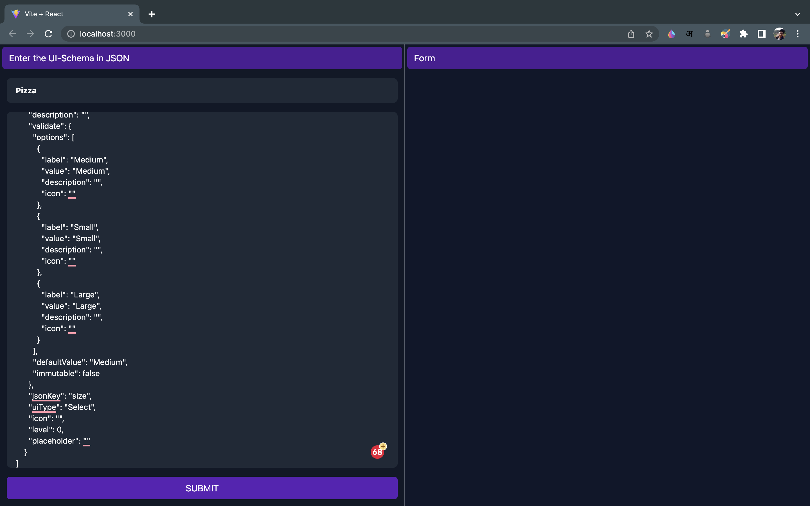
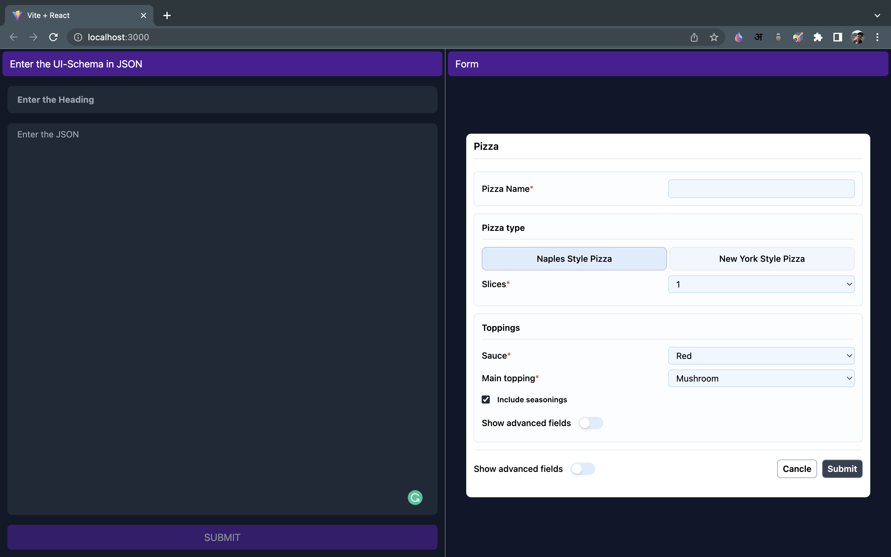

# Frontend-Assignment

A React application that will allow users to paste a UI schema on the left side and preview the rendered form on the right-hand side.
## Run Locally

Clone the project

```bash
  git clone https://github.com/Mohit-Thapliyal/Frontend-Assignment.git
```

Go to the project directory

```bash
  cd Frontend-Assignment
```

Install dependencies

```bash
  npm install
```

Start the server

```bash
  npm run dev
```

Start the server on specific port

```bash
  npm run dev -- --port <port number>
```

Build Project

```bash
  npm run build
```
## Link
https://frontend-assignment-amber.vercel.app

## Screenshots



